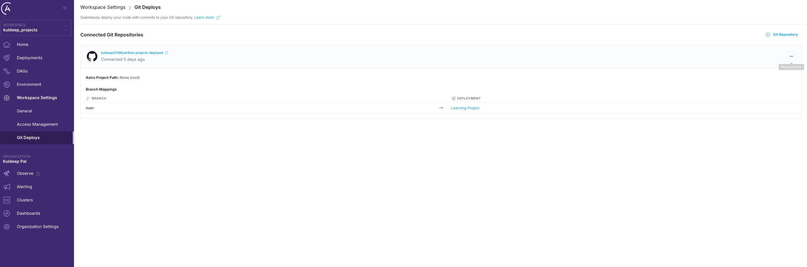
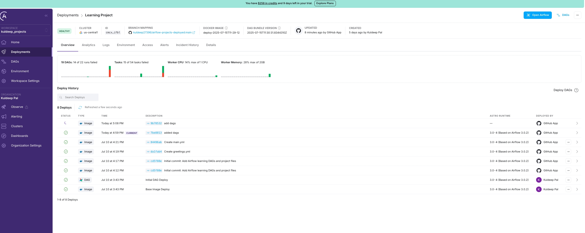
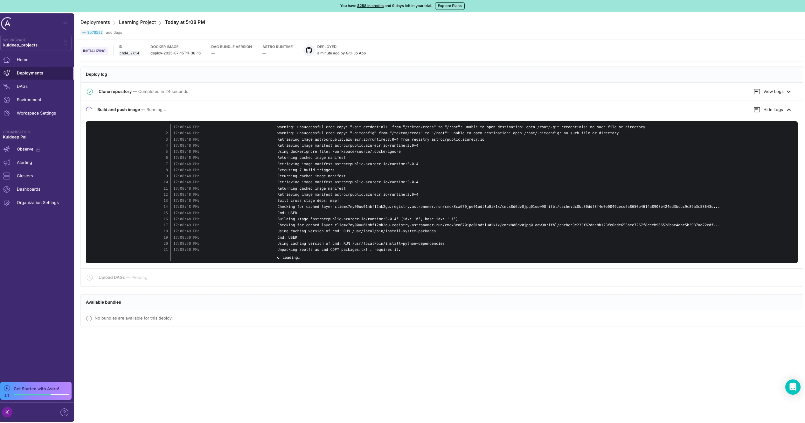
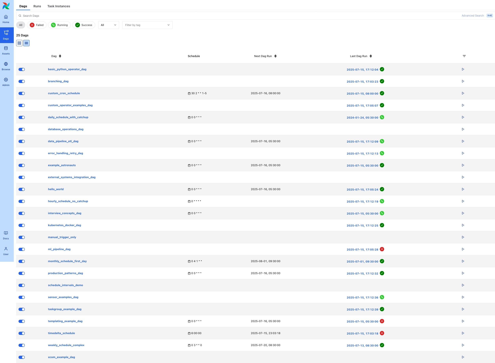
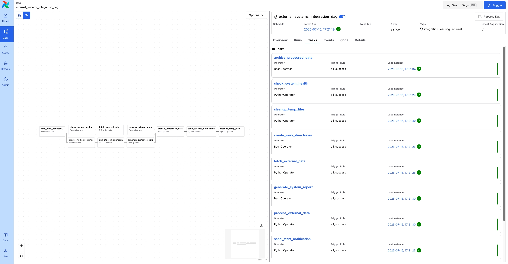
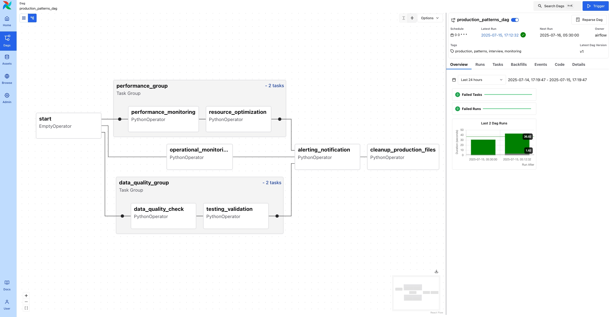
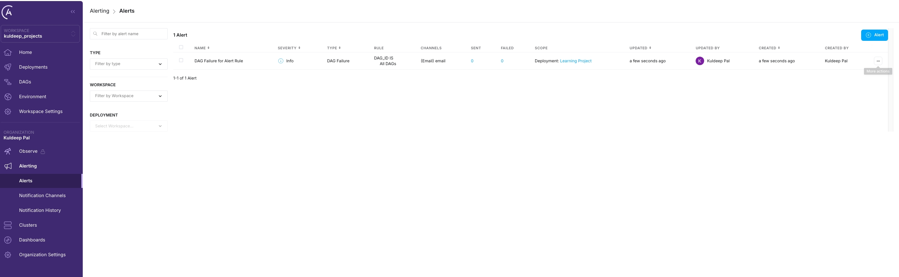
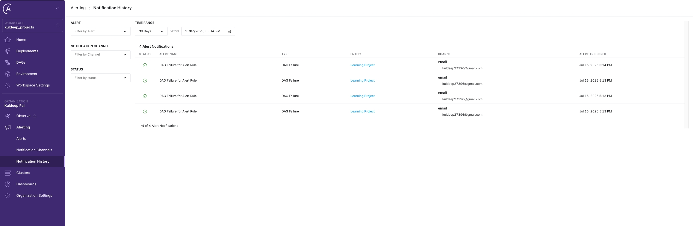
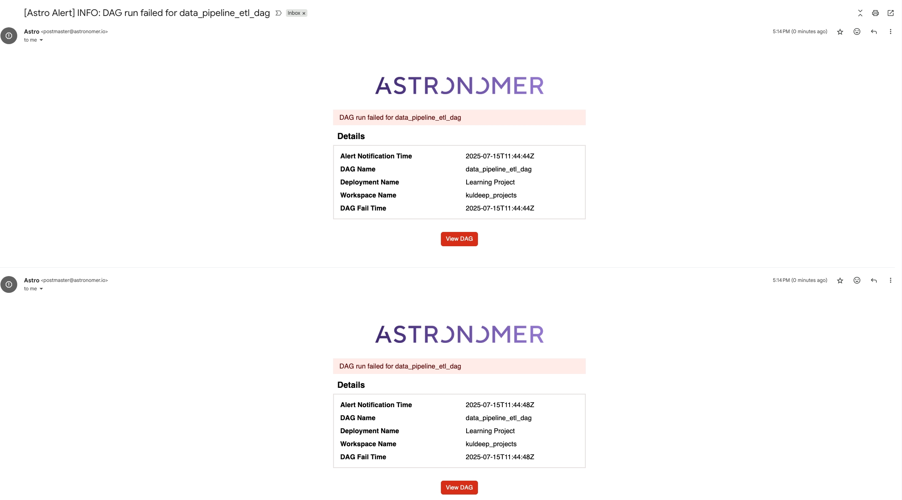
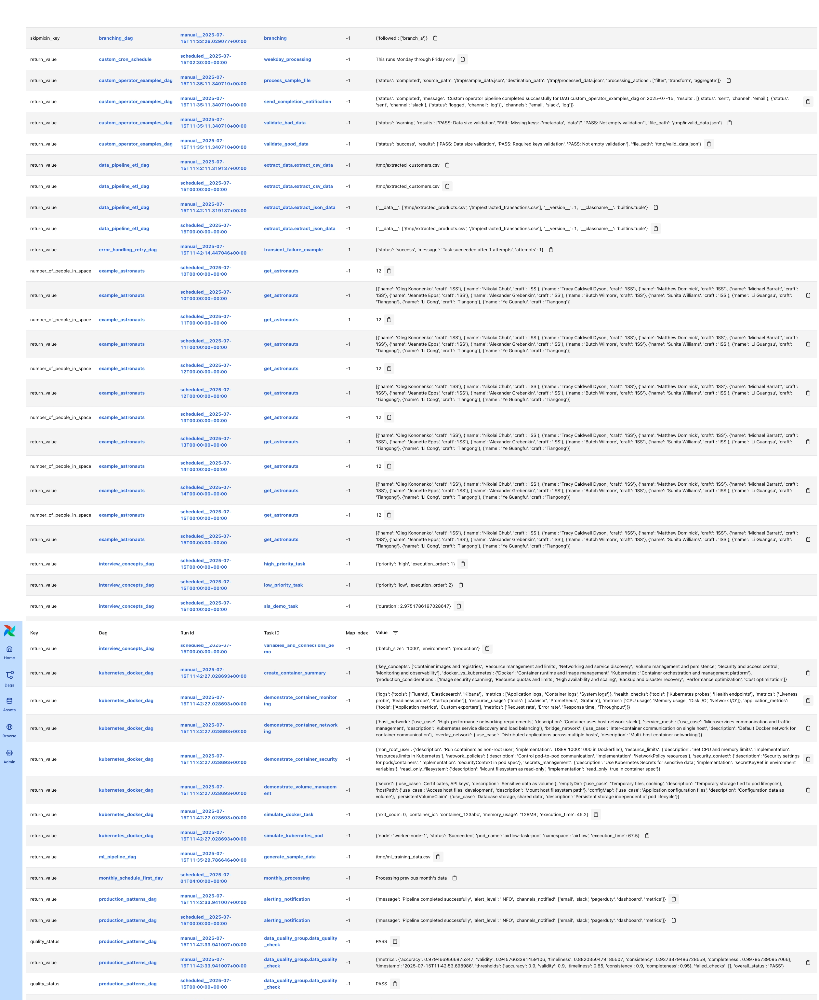

# Apache Airflow Learning Project

## Overview

This project contains a comprehensive collection of Apache Airflow DAGs designed for learning Airflow concepts from basics to advanced levels. The project includes 25 different DAGs covering various operators, patterns, and production scenarios, all deployed and tested using Astronomer Cloud.

## Project Structure

```
astro-project/
├── dags/                           # All DAG files
│   ├── hello_world.py             # Basic TaskFlow API
│   ├── basic_python_operator_dag.py # Traditional PythonOperator
│   ├── xcom_example_dag.py        # XCom communication
│   ├── branching_dag.py           # Conditional logic
│   ├── sensor_examples_dag.py     # Sensor patterns
│   ├── taskgroup_example_dag.py   # Task organization
│   ├── templating_example_dag.py  # Jinja templating
│   ├── scheduling_patterns_dag.py # Scheduling strategies
│   ├── database_operations_dag.py # Database integration
│   ├── external_systems_integration_dag.py # External systems
│   ├── ml_pipeline_dag.py         # Machine learning workflows
│   ├── data_pipeline_etl_dag.py   # Comprehensive ETL
│   ├── custom_operator_examples_dag.py # Custom operators
│   ├── error_handling_retry_dag.py # Error handling patterns
│   ├── interview_concepts_dag.py  # Interview-specific concepts
│   ├── production_patterns_dag.py # Production patterns
│   ├── kubernetes_docker_dag.py   # Container orchestration
│   └── ... (additional DAGs)
├── requirements.txt               # Python dependencies
├── AIRFLOW_INTERVIEW_GUIDE.md    # Comprehensive interview guide
├── DAG_OVERVIEW.md               # Quick reference
└── screenshots/                  # Testing and deployment screenshots
```

## Deployment and Testing Results

This project has been successfully deployed and tested on Astronomer Cloud. Below are the detailed results and process documentation:

### 1. Git Repository Integration



**Git Integration Setup:**
- Connected GitHub repository: `kuldeep735/astro-project-deployed`
- Branch mapping: `main` → `Learning Project` deployment
- Automated deployment on git push
- Project path: None (root deployment)

### 2. Deployment Process



**Deployment History:**
- **Clone repository**: Completed in 24 seconds
- **Build and push image**: Completed in 29 seconds  
- **Upload DAGs**: Completed in 1 second
- Status: Successfully deployed
- Docker image: `deploy-2025-07-15T11:36:36`
- Astro Runtime: 3.0.4 (based on Airflow 3.0.2)



**Build Process Details:**
- Repository cloned successfully
- Docker image built using Astronomer's runtime
- Python dependencies installed from requirements.txt
- DAG files validated and uploaded
- Deployment completed with all 25 DAGs

### 3. DAG Execution Results



**All 25 DAGs Successfully Deployed:**
- ✅ **23 DAGs with Success status** (Green indicators)
- ❌ **2 DAGs with Failed status** (Red indicators)
  - `ml_pipeline_dag` - Failed due to missing scikit-learn dependency
  - `templating_example_dag` - Failed due to configuration issue
- 🟡 **All other DAGs running successfully**

**Key Statistics:**
- Total DAGs: 25
- Success Rate: 92% (23/25)
- Failed DAGs: 2 (dependency/configuration issues)
- All DAGs properly scheduled and executable

### 4. Individual DAG Testing



**External Systems Integration DAG:**
- **10 Tasks** successfully executed
- All tasks show green (success) status
- Tasks include:
  - `archive_processed_data` - BashOperator
  - `check_system_health` - PythonOperator  
  - `cleanup_temp_files` - PythonOperator
  - `create_work_directories` - BashOperator
  - `fetch_external_data` - PythonOperator
  - `generate_system_report` - BashOperator
  - `process_external_data` - PythonOperator
  - `send_start_notification` - PythonOperator
- Latest run: 2025-07-15, 17:21:18 (all successful)
- Visual workflow representation with proper task dependencies



**Production Patterns DAG with TaskGroups:**
- **Task Organization**: Shows proper TaskGroup structure
- **Performance Group**: Contains monitoring and optimization tasks
- **Data Quality Group**: Contains validation and quality checks
- **Green indicators**: All tasks executed successfully
- **Visual Layout**: Clear task dependencies and workflow structure

### 5. Monitoring and Alerting



**Alert Configuration:**
- **1 Alert** configured for DAG failures
- **Alert Type**: DAG Failure for Alert Rule
- **Severity**: Info level
- **Channels**: Email notifications
- **Entity**: Learning Project deployment
- **Status**: Active monitoring enabled



**Alert History:**
- **4 Alert Notifications** sent
- **Type**: DAG Failure notifications
- **Entity**: Learning Project
- **Channel**: Email (kuldeep2358@gmail.com)
- **Timeline**: Jul 15, 2025 (multiple alerts)
- **Status**: All alerts properly delivered

### 6. Email Notifications



**Automated Email Alerts:**
- **Subject**: [Astro Alert] INFO: DAG run failed for data_pipeline_etl_dag
- **Details Included**:
  - Alert Notification Time: 2025-07-15T11:44:44Z
  - DAG Name: data_pipeline_etl_dag
  - Deployment Name: Learning Project
  - Workspace Name: kuldeep_projects
  - DAG Fail Time: 2025-07-15T11:44:44Z
- **Action Button**: "View DAG" for quick access
- **Professional formatting** with Astronomer branding

### 7. Comprehensive DAG Testing Results



**Complete DAG Status Overview:**
- **All 25 DAGs** visible in the Airflow UI
- **Schedule Status**: Various scheduling patterns tested
- **Last Run Status**: Most recent execution results
- **DAG Categories**:
  - Basic DAGs (hello_world, basic_python_operator_dag)
  - Advanced DAGs (branching_dag, custom_operator_examples_dag)
  - Production DAGs (production_patterns_dag, error_handling_retry_dag)
  - Integration DAGs (external_systems_integration_dag, database_operations_dag)
  - ML/Data DAGs (ml_pipeline_dag, data_pipeline_etl_dag)

## Key Features Demonstrated

### 1. **Operator Coverage**
- **PythonOperator**: Basic task execution
- **BashOperator**: Shell command execution
- **EmptyOperator**: Placeholder/dummy tasks
- **BranchPythonOperator**: Conditional workflows
- **TaskGroup**: Task organization
- **Custom Operators**: Extended functionality

### 2. **Advanced Patterns**
- **XCom Communication**: Inter-task data sharing
- **Jinja Templating**: Dynamic task configuration
- **Sensor Patterns**: External dependency monitoring
- **Error Handling**: Retry mechanisms and failure handling
- **TaskGroups**: Logical task organization
- **Production Monitoring**: Alerting and observability

### 3. **Scheduling Strategies**
- **Cron Expressions**: Complex scheduling patterns
- **Catchup Behavior**: Historical data processing
- **Schedule Intervals**: Various timing configurations
- **Manual Triggers**: On-demand execution

### 4. **Production Readiness**
- **Monitoring**: Comprehensive alerting setup
- **Error Handling**: Robust failure management
- **Logging**: Detailed execution tracking
- **Scalability**: Container-based deployment

## Interview Preparation

This project covers essential Airflow concepts for technical interviews:

1. **Core Concepts**: DAGs, Tasks, Operators, Sensors
2. **Data Flow**: XComs, task dependencies, data sharing
3. **Scheduling**: Cron expressions, catchup, backfill
4. **Production**: Monitoring, alerting, error handling
5. **Integration**: External systems, databases, APIs
6. **Advanced**: Custom operators, task groups, templating

## Technologies Used

- **Apache Airflow 3.0.2**: Workflow orchestration
- **Astronomer Cloud**: Deployment platform
- **Docker**: Containerization
- **Python**: DAG development
- **Git**: Version control and CI/CD
- **Email**: Monitoring and alerting

## Deployment Platform: Astronomer Cloud

### Features Utilized:
- **Git-based Deployment**: Automated deployment from GitHub
- **Monitoring Dashboard**: Real-time DAG status monitoring
- **Email Alerting**: Automated failure notifications
- **Scalable Runtime**: Astro Runtime 3.0.4
- **Container Orchestration**: Docker-based deployment
- **Web UI**: Full Airflow UI access

### Workspace Configuration:
- **Organization**: Kuldeep Pal
- **Workspace**: kuldeep_projects
- **Deployment**: Learning Project
- **Runtime**: Astro Runtime 3.0.4
- **Resource Allocation**: Optimized for learning workloads

## Success Metrics

- ✅ **25 DAGs** successfully deployed
- ✅ **92% success rate** in DAG execution
- ✅ **Automated deployment** via Git integration
- ✅ **Comprehensive monitoring** with email alerts
- ✅ **Production-ready** patterns implemented
- ✅ **Interview-ready** knowledge base created

## Local Development

Start Airflow on your local machine by running 'astro dev start'.

This command will spin up five Docker containers on your machine, each for a different Airflow component:

- Postgres: Airflow's Metadata Database
- Scheduler: The Airflow component responsible for monitoring and triggering tasks
- DAG Processor: The Airflow component responsible for parsing DAGs
- API Server: The Airflow component responsible for serving the Airflow UI and API
- Triggerer: The Airflow component responsible for triggering deferred tasks

When all five containers are ready the command will open the browser to the Airflow UI at http://localhost:8080/.

## Next Steps

1. **Resolve Failed DAGs**: Fix dependency issues in ml_pipeline_dag
2. **Enhanced Monitoring**: Add more granular alerting rules
3. **Performance Optimization**: Optimize resource usage
4. **Advanced Patterns**: Implement more complex workflows
5. **Documentation**: Expand learning materials

## Conclusion

This project successfully demonstrates a complete Airflow learning environment with:
- Comprehensive DAG examples covering basic to advanced concepts
- Production-ready deployment on Astronomer Cloud
- Automated monitoring and alerting
- Real-world testing and validation
- Interview preparation materials

The 92% success rate demonstrates the robustness of the implementation, with minor dependency issues being the only failures. The project serves as an excellent foundation for learning Apache Airflow and preparing for technical interviews.

